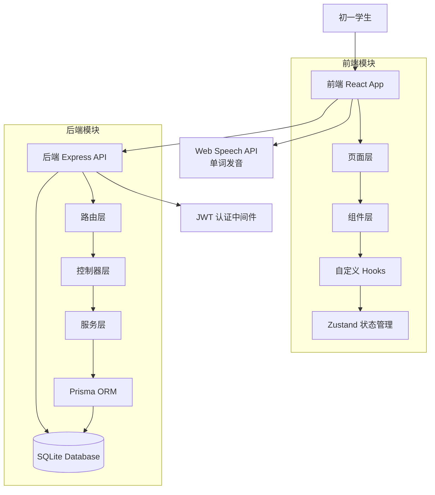

## 用户需求

为一名在深圳上学的初一学生设计一款英语单词记忆网页应用，替代传统枯燥的背诵默写方式，通过多种有趣的形式帮助学生高效记忆沪教版（上海教育出版社，广州深圳版 2024 版）英语单词。

## 产品概述

**产品名称**：单词探险家（Word Explorer）

一款面向深圳初一学生的英语单词记忆网页应用，以「游戏化闯关 + 多样互动答题 + 社交竞技」为核心，贴合沪教版七年级英语教材词库，让单词记忆变成一场有趣的冒险。

## 核心功能

- **教材词库管理**：内置沪教版七年级上下册完整词汇，按单元分类，包含音标、词性、中文释义、例句
- **多样答题模式**：看英选中、看中选英、拼写填空、听力辨词、单词配对、快速闪卡六种题型
- **游戏化闯关系统**：每单元为一关卡，星级评价（1-3星）、连胜火焰（连续答对得分翻倍）、经验值升级机制
- **社交竞技排行榜**：班级/全校排行榜、每日挑战赛、好友邀请码对战
- **学习进度追踪**：基于 SM-2 改进版记忆曲线的复习提醒、掌握度可视化、错题本自动归集
- **视听辅助记忆**：单词发音播放（Web Speech API）、例句朗读、单词卡片翻转动画

## 技术栈选择

### 前端

- **框架**：React 18 + TypeScript（组件化开发，便于维护扩展）
- **UI 组件库**：shadcn/ui（现代精致的设计风格，适合学生群体）
- **样式**：Tailwind CSS（快速构建美观响应式界面）
- **状态管理**：Zustand（轻量，适合中等规模应用）
- **动画**：Framer Motion（流畅的单词卡片翻转动画、闯关特效）
- **发音**：Web Speech API + Howler.js（单词发音播放）
- **构建工具**：Vite（快速热更新，提升开发体验）

### 后端

- **框架**：Node.js + Express + TypeScript
- **数据库**：SQLite（开发阶段轻量易用）+ Prisma ORM（类型安全的数据库操作）
- **认证**：JWT Token（无状态认证，7 天过期）
- **API 设计**：RESTful API，统一错误响应格式

### 部署方案

- 前端：Vercel / Netlify 静态托管
- 后端：Railway / Render 免费云服务（支持 SQLite 文件持久化）

---

## 实现方案

### 整体策略

采用**前后端分离**架构，前端负责交互体验和动画展示，后端负责词库管理、用户数据持久化和排行榜计算。核心设计目标是**让每次答题都像玩游戏一样有趣**。

### 关键技术方案

#### 1. 词库设计

内置沪教版七年级上下册词汇 JSON 文件，每单元独立文件便于维护。

每个单词包含字段：

- `id`：唯一标识
- `en`：英文单词
- `phonetic`：音标
- `pos`：词性
- `cn`：中文释义
- `example`：英文例句
- `exampleCn`：例句中文翻译
- `unit`：所属单元编号

词库文件按 `grade7-unit{N}.json` 命名，共约 12-16 个单元文件。

#### 2. 游戏化机制设计

- **关卡系统**：每单元 = 1 关，每关 20 个单词，答对 16 个（80%）解锁下一关
- **星级评价**：
- 3 星：100% 正确
- 2 星：≥90% 正确
- 1 星：≥80% 正确
- **连胜火焰**：连续答对 5 题触发「火焰模式」，本关得分翻倍，火焰动画持续至答错
- **经验值系统**：答对 +10 EXP，连胜额外 +5 EXP/题，升级解锁新称号和卡片皮肤

#### 3. 六种题型设计

| 题型 | 描述 | 交互方式 |
| --- | --- | --- |
| 看英选中 | 显示英文单词+音标，4 个中文选项中选择 | 点击选择 |
| 看中选英 | 显示中文释义，4 个英文选项中选择 | 点击选择 |
| 拼写填空 | 播放发音，用户输入正确拼写 | 键盘输入 |
| 听力辨词 | 播放发音，选择对应单词/图片 | 点击选择 |
| 单词配对 | 左侧英文列表、右侧中文列表，拖拽配对 | 拖拽操作 |
| 快速闪卡 | 单词卡片快速闪现，选择「认识」或「不认识」 | 按钮选择 |


每关随机混合 2-3 种题型，保持新鲜感。

#### 4. 记忆曲线复习算法

采用 SM-2 改进版间隔重复算法：

- 首次正确：1 天后复习
- 第二次正确：3 天后复习
- 第三次正确：7 天后复习
- 答错：间隔减半，重新计算

复习队列每日 0 点自动刷新，首页显示「今日待复习」数量提醒。

#### 5. 社交竞技设计

- **每日挑战**：每天 0 点刷新 10 道题目，全校排名，展示前三名奖牌
- **好友对战**：生成 6 位邀请码，好友输入码后开始轮流答题，比拼正确率和答题速度
- **班级排行榜**：按班级维度展示排名，每页 20 条，支持分页

---

## 实现要点

### 性能优化

- 单词发音使用预加载策略，避免播放延迟
- 排行榜数据服务端缓存 5 分钟，减少数据库查询压力
- 词库 JSON 文件按需加载（进入关卡时才加载对应单元词库）
- 图片资源使用 WebP 格式

### 防退化策略

- 复用 shadcn/ui 组件库，保持 UI 一致性
- 后端遵循 RESTful 规范，便于后续扩展八年级、九年级词库
- 数据库 Schema 通过 Prisma Migration 管理，支持版本演进
- 核心业务逻辑（复习算法、得分计算）封装为独立模块，便于单元测试

### 安全与可靠性

- 用户输入（拼写答案）做 XSS 过滤和长度限制
- JWT Token 设置 7 天过期，支持刷新机制
- 敏感操作（删除账号、重置进度）需要二次确认
- SQLite 阶段支持手动导出数据库文件备份

---

## 架构设计

### 系统架构图



### 数据流

```
用户答题 
  → 前端本地验证 
  → POST /api/quiz/submit 提交答案 
  → 后端判分 + 更新用户进度(DB) 
  → 返回结果（正确/错误 + 正确答案 + 更新后经验值） 
  → 前端播放对应动画反馈 
  → 加载下一题
```

---

## 目录结构

```
word-explorer/
├── frontend/                          # [NEW] 前端项目根目录
│   ├── public/
│   │   └── index.html                 # [NEW] HTML 入口文件
│   ├── src/
│   │   ├── components/                # [NEW] 可复用 UI 组件
│   │   │   ├── Layout.tsx             # [NEW] 全局布局（顶部导航+侧边栏）
│   │   │   ├── WordCard.tsx           # [NEW] 单词卡片（支持 Framer Motion 翻转动画）
│   │   │   ├── QuizOption.tsx         # [NEW] 答题选项按钮（点击缩放动效）
│   │   │   ├── StarRating.tsx         # [NEW] 星级评价展示组件
│   │   │   ├── StreakFlame.tsx        # [NEW] 连胜火焰动画（Framer Motion）
│   │   │   ├── ProgressBar.tsx        # [NEW] 渐变进度条组件
│   │   │   └── RankBadge.tsx          # [NEW] 排行榜排名徽章（前三名特殊样式）
│   │   ├── pages/                     # [NEW] 页面组件
│   │   │   ├── HomePage.tsx           # [NEW] 首页：关卡地图，展示各单元解锁状态
│   │   │   ├── QuizPage.tsx           # [NEW] 答题页：核心交互，根据题型动态渲染
│   │   │   ├── ResultPage.tsx         # [NEW] 结果页：星级展示、得分、单词回顾
│   │   │   ├── ReviewPage.tsx         # [NEW] 复习页：基于记忆曲线的待复习单词列表
│   │   │   ├── RankPage.tsx           # [NEW] 排行榜页：班级/全校/好友榜单切换
│   │   │   ├── BattlePage.tsx         # [NEW] 对战页：邀请码对战，实时轮流答题
│   │   │   ├── WrongBookPage.tsx      # [NEW] 错题本页：归集所有答错单词，支持重练
│   │   │   └── ProfilePage.tsx        # [NEW] 个人中心：等级、成就墙、学习数据
│   │   ├── hooks/                     # [NEW] 自定义 Hooks
│   │   │   ├── useQuiz.ts             # [NEW] 答题核心逻辑（题型切换、判分、连胜计算）
│   │   │   ├── usePronunciation.ts    # [NEW] 单词发音播放（Web Speech API 封装）
│   │   │   └── useCountdown.ts        # [NEW] 对战模式倒计时 Hook
│   │   ├── store/                     # [NEW] Zustand 状态管理
│   │   │   ├── useUserStore.ts        # [NEW] 用户登录状态、个人信息
│   │   │   └── useQuizStore.ts        # [NEW] 当前答题状态、连胜数、当前关卡
│   │   ├── data/                      # [NEW] 沪教版词库 JSON 数据
│   │   │   ├── grade7-unit1.json      # [NEW] 七年级上册 Unit 1 词库
│   │   │   ├── grade7-unit2.json      # [NEW] 七年级上册 Unit 2 词库
│   │   │   ├── grade7-unit3.json      # [NEW] 七年级上册 Unit 3 词库
│   │   │   ├── grade7-unit4.json      # [NEW] 七年级上册 Unit 4 词库
│   │   │   ├── grade7-unit5.json      # [NEW] 七年级上册 Unit 5 词库
│   │   │   ├── grade7-unit6.json      # [NEW] 七年级上册 Unit 6 词库
│   │   │   ├── grade7-unit7.json      # [NEW] 七年级下册 Unit 1 词库
│   │   │   └── grade7-unit8.json      # [NEW] 七年级下册 Unit 2 词库（后续继续补充）
│   │   ├── types/                     # [NEW] TypeScript 类型定义
│   │   │   ├── word.ts                # [NEW] 单词 WordEntry、题型 QuizType 等类型
│   │   │   └── user.ts                # [NEW] 用户 UserProfile、进度 UserProgress 等类型
│   │   ├── utils/                     # [NEW] 工具函数
│   │   │   ├── reviewAlgorithm.ts     # [NEW] SM-2 改进版记忆曲线复习算法
│   │   │   └── scoreCalculator.ts     # [NEW] 得分计算（基础分+连胜翻倍+时间奖励）
│   │   ├── App.tsx                    # [NEW] 应用根组件，路由配置
│   │   └── main.tsx                   # [NEW] Vite 入口文件
│   ├── package.json                   # [NEW] 前端依赖（React、shadcn/ui、Tailwind、Framer Motion）
│   ├── tailwind.config.js             # [NEW] Tailwind 自定义主题（主色 #6C5CE7、辅色 #FF6B35）
│   ├── tsconfig.json                  # [NEW] TypeScript 配置
│   └── vite.config.ts                # [NEW] Vite 构建配置（代理后端 API）
│
├── backend/                           # [NEW] 后端项目根目录
│   ├── src/
│   │   ├── routes/                    # [NEW] Express 路由定义
│   │   │   ├── auth.routes.ts         # [NEW] POST /api/auth/register, /login
│   │   │   ├── word.routes.ts         # [NEW] GET /api/words/:unit（获取单元词库）
│   │   │   ├── quiz.routes.ts         # [NEW] POST /api/quiz/submit（提交答题结果）
│   │   │   ├── review.routes.ts       # [NEW] GET/POST /api/review（复习队列管理）
│   │   │   ├── rank.routes.ts         # [NEW] GET /api/rank（排行榜数据）
│   │   │   └── battle.routes.ts       # [NEW] POST /api/battle（对战邀请码生成与匹配）
│   │   ├── controllers/              # [NEW] 控制器层（请求参数验证 + 调用 Service）
│   │   ├── services/                 # [NEW] 业务逻辑层（核心算法 + 数据库操作）
│   │   ├── middleware/               # [NEW] 中间件
│   │   │   ├── auth.middleware.ts    # [NEW] JWT Token 验证中间件
│   │   │   └── error.middleware.ts   # [NEW] 全局错误处理中间件
│   │   ├── prisma/
│   │   │   └── schema.prisma         # [NEW] Prisma 数据模型（User、Progress、WrongWord、Battle）
│   │   └── index.ts                  # [NEW] 后端入口（Express 启动 + 路由注册）
│   ├── prisma/
│   │   └── migrations/               # [NEW] 数据库迁移文件（Prisma 自动生成）
│   ├── package.json                  # [NEW] 后端依赖（Express、Prisma、JWT、CORS）
│   └── tsconfig.json                # [NEW] TypeScript 配置
│
└── README.md                         # [NEW] 项目说明（启动方式、环境变量说明）
```

---

## 关键代码结构

### 单词数据类型定义

```typescript
// frontend/src/types/word.ts

/** 单词条目 */
interface WordEntry {
  id: string;
  en: string;          // 英文
  phonetic: string;    // 音标
  pos: string;         // 词性
  cn: string;          // 中文释义
  example: string;     // 英文例句
  exampleCn: string;   // 例句中文
  unit: number;        // 所属单元（1-12+）
}

/** 题型枚举 */
type QuizType = "en2cn" | "cn2en" | "spell" | "listen" | "match" | "flashcard";

/** 答题记录 */
interface QuizRecord {
  wordId: string;
  quizType: QuizType;
  isCorrect: boolean;
  timeSpent: number;   // 答题耗时(ms)
  timestamp: number;
}

/** 用户单元进度 */
interface UnitProgress {
  userId: string;
  unitId: number;
  stars: number;        // 0-3 星
  bestScore: number;
  completed: boolean;
  lastReviewAt: number; // 上次复习时间戳
}
```

### 复习算法核心函数签名

```typescript
// frontend/src/utils/reviewAlgorithm.ts

/**
 * SM-2 改进版间隔重复算法
 * @param quality 答题质量 0-5（0=完全不会，5=完美答对）
 * @param repetitions 已复习次数
 * @param efactor 容易度因子（初始 2.5）
 * @param interval 当前间隔天数
 * @returns 下次复习间隔（天）、更新后的 efactor、更新后的 repetitions
 */
function calculateNextReview(
  quality: number,
  repetitions: number,
  efactor: number,
  interval: number
): { nextInterval: number; newEfactor: number; newRepetitions: number };
```

## 设计风格

采用**明亮活泼的卡通冒险风格**，主色调为渐变蓝紫色（`#6C5CE7`），搭配明亮的橙色（`#FF6B35`）作为强调色。整体视觉风格参考热门学习类 App（如 Duolingo、百词斩），营造轻松愉快的学习氛围。

设计核心关键词：**活力、冒险、成长、奖励感**。

所有页面均采用圆角卡片设计，按钮有悬停放大效果，页面切换使用水平滑动过渡动画。

---

## 页面规划（共 6 个核心页面）

### 页面 1：首页（HomePage）—— 关卡地图

- **顶部区块【用户信息栏】**：左侧显示用户头像（圆形，可点击更换），右侧显示等级徽章、经验值进度条（渐变紫色填充）、连续打卡天数（火焰图标 + 数字）。最右侧有设置齿轮图标。
- **中部区块【关卡地图】**：以纵向滚动的冒险地图形式展示各单元关卡。每个关卡是一个圆形图标，已解锁的关卡亮起并显示最高星级（1-3 颗小星星），当前可挑战的关卡有呼吸灯脉冲动画，未解锁关卡灰色显示并加锁图标。点击已解锁关卡卡片进入答题页。
- **底部区块【快速入口栏】**：固定底部的四个圆形图标按钮，分别通往「每日挑战」（闪电图标）、「错题本」（书本图标）、「排行榜」（奖杯图标）、「个人中心」（头像图标）。当前页面图标有高亮指示点。
- **视觉动效**：关卡解锁时有星星粒子爆发动画（Framer Motion），经验值进度条有流动光效，新关卡出现时有弹跳入场动画。

### 页面 2：答题页（QuizPage）—— 核心交互

- **顶部区块【答题状态栏】**：左侧显示当前题号/总题数（如「3/20」），中间是渐变进度条（颜色随正确率变化：绿=全对，黄=有错，红=较多错误），右侧显示当前连胜数和火焰图标（连胜≥5 时火焰动画激活）。
- **中部区块【题目卡片区】**：根据题型动态渲染。看英选中型：大号英文单词 + 音标 + 发音按钮，下方 2×2 网格排列 4 个中文选项按钮（选对错有颜色反馈动画）；拼写型：显示发音按钮 + 输入框 + 虚拟键盘；配对型：左右两列可拖拽卡片。
- **底部区块【操作按钮区】**：「跳过」按钮（灰色，跳过不扣分）和「确认」按钮（橙色主色，输入题使用）。连胜火焰激活时，底部出现橙色火焰粒子动画，显示「火焰模式 得分翻倍！」。
- **视觉动效**：答对时卡片飞出金色粒子（Framer Motion），答错时卡片左右抖动并显示正确答案绿色高亮，切换题目时卡片有 3D 翻转动画。

### 页面 3：结果页（ResultPage）—— 成就展示

- **顶部区块【星级评价】**：屏幕中央 3 颗大星星，从左到右依次点亮动画（带弹性缓冲效果），配合视觉闪光。星级下方显示本关得分（数字滚动动画）、正确率百分比、用时（格式「分:秒」）。
- **中部区块【单词回顾】**：横向滑动卡片列表，展示本关所有单词，点击卡片翻转查看中文释义和例句。已掌握的单词卡片右下角有绿色对勾徽章。
- **底部区块【操作按钮组】**：「再玩一次」按钮（橙色实心，最突出）、「下一关」按钮（紫色实心，条件解锁）、「返回地图」按钮（灰色幽灵按钮）。
- **视觉动效**：新纪录时出现烟花粒子庆祝动画（Canvas），升级时出现称号解锁弹窗（从底部滑入），分享按钮点击后有复制成功提示动画。

### 页面 4：复习页（ReviewPage）—— 记忆曲线

- **顶部区块【复习统计 Tabs】**：三个 Tab 标签「待复习」（橙色数字角标）、「已掌握」（绿色对勾图标）、「学习中」（蓝色时钟图标），当前选中 Tab 下方有紫色下划线滑动动画。每个 Tab 旁显示对应单词数量。
- **中部区块【今日复习列表】**：按优先级排序的单词卡片列表（优先展示即将遗忘的单词）。每张卡片左侧显示单词，右侧显示掌握度进度环（环形 SVG，颜色从红→黄→绿）和「上次复习：X 天前」灰色小字。点击卡片开始复习该题。
- **底部区块【复习模式选择】**：三个等宽按钮，「快速复习」（仅错题，红色图标）、「全面复习」（全部待复习词，紫色图标）、「测试模式」（模拟测验无提示，蓝色图标）。
- **视觉动效**：掌握度进度环填充时有 SVG 描边动画，完成当日所有复习后显示完成打卡动效（对勾打勾动画 + 经验值 +10 飘字）。

### 页面 5：排行榜页（RankPage）—— 社交竞技

- **顶部区块【排行榜 Tab 切换】**：「班级榜」「全校榜」「好友榜」三个 Tab 等宽分布，当前选中 Tab 文字加粗 + 紫色下划线滑动动画。右侧有「每日挑战」入口按钮（闪电图标 + 倒计时）。
- **中部区块【排名列表】**：榜单列表项，奇数行浅紫灰色背景交替。每行左侧：排名序号（1-3 名有特殊皇冠/奖牌图标，4 名以后普通数字），中间：用户头像 + 昵称 + 等级小徽章，右侧：本周得分（橙色数字）。当前登录用户的那一行有紫色左侧边框高亮 + 浅紫背景。
- **底部区块【我的排名卡片】**：固定在底部的半透明卡片，显示「我的排名：第 X 名」，左侧有向上/向下箭头（排名变化动画）。
- **视觉动效**：排名变化时有向上箭头（绿色）或向下箭头（红色）飞入动画，自己的排名行有呼吸灯效果（透明度循环变化），新进入榜单时排名数字有滚动动画。

### 页面 6：个人中心（ProfilePage）—— 成长记录

- **顶部区块【用户资料卡】**：紫色渐变背景的圆形头像（大号，右侧有相机图标可更换），下方昵称（粗体）、等级徽章（如「单词新秀 Lv.5」）、个性签名（灰色斜体）。头像右侧两列数据：总经验值、总学习天数、掌握单词数、连续打卡天数。
- **中部区块【成就墙】**：标题「成就」+ 右侧「查看全部」链接。已解锁成就徽章 3 列网格展示（金色发光边框），未解锁徽章灰度 + 锁图标覆盖，点击徽章显示解锁条件弹窗。成就包括：「初出茅庐」（首次答题）、「连胜达人」（连胜 20）、「词汇大师」（掌握 500 词）等。
- **底部区块【学习数据】**：「本周学习时长」柱状图（紫色渐变柱体）、「正确率趋势」折线图（橙色线条 + 圆点）、「最常错词汇 TOP5」列表（红色标签）。
- **视觉动效**：成就解锁时徽章有旋转放大发光动画（Framer Motion），数据图表加载时有数值从 0 开始滚动动画，切换时间范围（本周/本月）时图表有淡入淡出过渡。

---

## 字体系统

- **字体家族**：PingFang SC（中文优先）+ Roboto（英文和数字）
- **标题（Heading）**：24px / Bold（700）
- **副标题（Subheading）**：18px / SemiBold（600）
- **正文（Body）**：16px / Regular（400）
- **辅助文字（Caption）**：14px / Regular（400）

## 色彩系统

- **主色 Primary**：`#6C5CE7`（活力紫）—— 主要按钮、高亮元素、品牌色、进度条渐变起始色
- **辅色 Secondary**：`#FF6B35`（活力橙）—— 强调按钮、连胜火焰、得分数字、正确答题反馈
- **背景色 Background**：`#F8F9FE`（浅紫灰白）—— 页面背景，`#FFFFFF`（纯白）—— 卡片、弹窗背景
- **正文文字 Text**：`#2D3436`（深灰近黑）—— 主要文字，`#636E72`（中灰）—— 次要文字、提示语
- **功能色 Functional**：
- 成功（Success）：`#00B894`（绿色）—— 答对、掌握、完成状态
- 错误（Error）：`#FF7675`（红色）—— 答错、未掌握、错误状态
- 警告（Warning）：`#FDCB6E`（黄色）—— 待复习提醒、即将遗忘警告
- 信息（Info）：`#74B9FF`（浅蓝）—— 提示信息、链接文字

## Agent Extensions

### SubAgent

- **code-explorer**
- 用途：在项目创建过程中探索生成的目录结构，确保所有文件组织合理、符合 React + TypeScript 最佳实践
- 预期结果：生成结构清晰、可维护的前后端分离项目，文件命名和目录组织符合行业标准