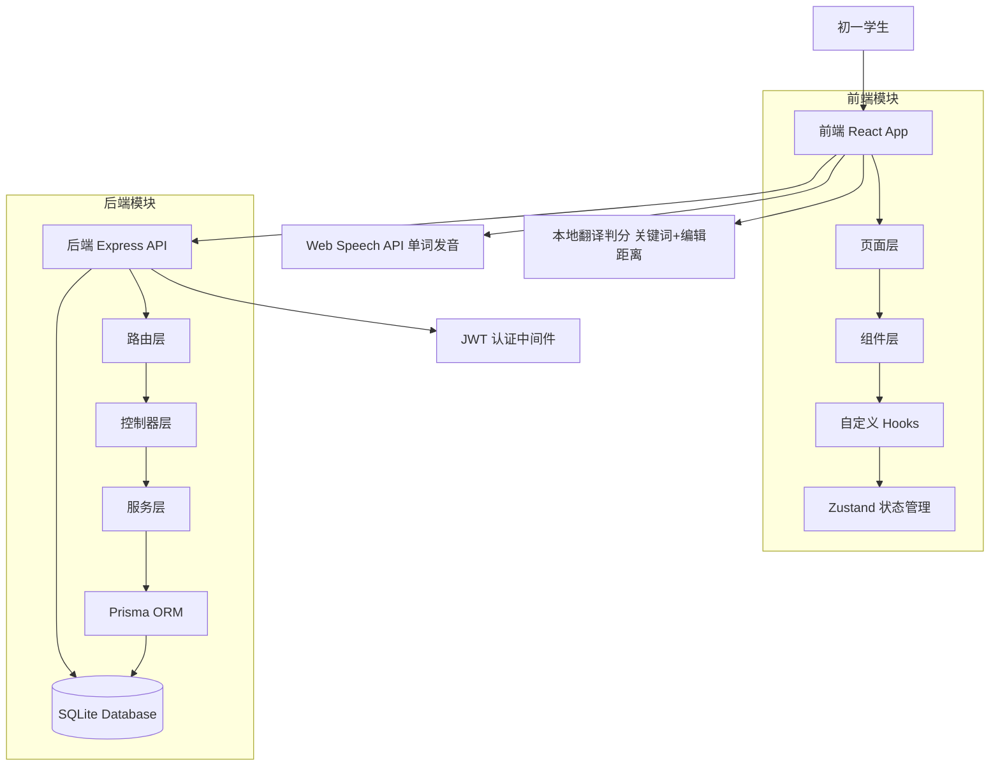

## 产品概述

为深圳初一学生设计一款名为「单词探险家（Word Explorer）」的英语单词记忆网页应用。以沪教版（广州深圳版）七至九年级教材词库为基础，通过游戏化闯关、多样互动题型、句子生成翻译模式，让单词记忆过程充满乐趣与实效。

## 核心功能

- **教材词库管理**：内置沪教版七至九年级全部词汇（约1800-2200词），按年级和单元双层分类，含音标、词性、中文释义、例句
- **多样答题模式**：看英选中、看中选英、拼写填空、听力辨词、单词配对、快速闪卡、句子翻译七种题型随机混合
- **句子生成翻译模式**：系统根据目标单词生成英文句子或短文，学生通过中文翻译输入或选择题判断单词掌握情况；包含短句模式（日常练习）和段落模式（闯关模式）；翻译填空和选择题两种交互随机混合
- **游戏化闯关系统**：每单元为一关卡，星级评价（1-3星）、连胜火焰（连续答对得分翻倍）、经验值升级机制
- **学习进度追踪**：基于SM-2改进版记忆曲线的复习提醒、掌握度可视化、错题本自动归集
- **视听辅助记忆**：单词发音播放（Web Speech API）、例句朗读、单词卡片翻转动画
- **个人中心**：用户资料、成就墙（徽章系统）、学习数据图表、错题本入口

## 技术栈选择

### 前端

- **框架**：React 18 + TypeScript
- **UI 组件库**：shadcn/ui
- **样式**：Tailwind CSS 3.4.17 + tailwindcss-animate
- **状态管理**：Zustand
- **动画**：Framer Motion
- **发音**：Web Speech API
- **翻译判分**：关键词匹配 + 编辑距离算法（Levenshtein Distance），前端本地判分
- **构建工具**：Vite 5

### 后端

- **框架**：Node.js + Express + TypeScript
- **数据库**：SQLite + Prisma ORM
- **认证**：JWT Token（7天过期）
- **API 设计**：RESTful API

---

## 实现方案

### 整体策略

采用前后端分离架构。核心设计目标是让每次答题都像玩游戏一样有趣，通过句子语境真正掌握单词含义。

### 关键技术方案

#### 1. 词库设计

内置沪教版七至九年级词汇JSON文件，按 `grade{7-9}-unit{N}.json` 命名，共约20-24个单元文件。

每个单词字段：`id`、`en`、`phonetic`、`pos`、`cn`（数组，支持多义项）、`example`、`exampleCn`、`grade`、`unit`。

#### 2. 句子生成模式（新增核心功能）

**句子来源优先级**：

1. 教材原句（`example` 字段存在时直接使用）
2. 内置句子模板库（按词性分类，动态填充）
3. 简单生成句子（基于单词释义，使用基础词汇构造）

**短句模式**（日常练习/复习）：

- 每句含1个目标单词，句子长度5-8个单词
- 交互方式随机混合：翻译填空（输入中文）或选择题（4选1）
- 翻译填空判分：提取关键词，计算编辑距离，相似度≥70%视为正确

**段落模式**（闯关模式）：

- 含3-5个目标单词的短段落，50-80词
- 每个目标单词对应一道翻译题（填空或选择）
- 段落内容围绕单元主题，使用已学单词，不超纲

**翻译判分算法**：

- 关键词提取（中文释义的分词核心词）
- 编辑距离计算（Levenshtein Distance）
- 相似度 = 1 - 编辑距离 / max(len1, len2)
- 相似度 ≥ 0.7 视为正确
- 完全包含核心关键词也视为正确

#### 3. 游戏化机制设计

- **关卡系统**：每单元 = 1关，按年级分层展示（7年级→8年级→9年级）
- **星级评价**：3星≥95%正确，2星≥85%正确，1星≥70%正确
- **连胜火焰**：连续答对5题触发火焰模式，得分翻倍
- **经验值系统**：答对+10 EXP，连胜额外+5 EXP/题

#### 4. 七种题型设计

| 题型 | 描述 | 交互方式 |
| --- | --- | --- |
| 看英选中 | 显示英文单词+音标，4个中文选项中选择 | 点击选择 |
| 看中选英 | 显示中文释义，4个英文选项中选择 | 点击选择 |
| 拼写填空 | 播放发音，用户输入正确拼写 | 键盘输入 |
| 听力辨词 | 播放发音，选择对应单词 | 点击选择 |
| 单词配对 | 左侧英文列表、右侧中文列表，拖拽配对 | 拖拽操作 |
| 快速闪卡 | 单词卡片快速闪现，选择认识或不认识 | 按钮选择 |
| 句子翻译 | 显示含目标词的英文句子/段落，填写中文或选择 | 输入/点击 |


#### 5. 记忆曲线复习算法

采用SM-2改进版间隔重复算法：首次正确1天后复习，第二次3天后，第三次7天后，答错间隔减半。

---

## 实现要点

### 性能优化

- 单词发音使用预加载策略
- 词库JSON文件按需加载（进入关卡时才加载对应单元词库）
- 句子模板库预加载至前端内存，生成句子无需网络请求
- 翻译判分算法在前端本地执行

### 安全与可靠性

- 用户输入（拼写答案、翻译输入）做XSS过滤和长度限制
- JWT Token设置7天过期，支持刷新机制

---

## 架构设计

### 系统架构图



### 数据流（句子翻译题）

```
系统生成含目标词的句子
  → 显示英文句子 + 输入框/选择题选项
  → 学生输入中文翻译 OR 选择中文选项
  → 前端本地判分（关键词匹配 + 编辑距离）
  → 返回结果（正确/错误 + 参考译文）
  → 播放对应动画反馈
  → 更新连胜数和经验值
  → 加载下一题
```

---

## 目录结构

```
word-explorer/
├── frontend/
│   ├── public/
│   │   └── index.html
│   ├── src/
│   │   ├── components/
│   │   │   ├── Layout.tsx             # 全局布局
│   │   │   ├── WordCard.tsx           # 单词卡片（翻转动画）
│   │   │   ├── QuizOption.tsx         # 答题选项按钮
│   │   │   ├── StarRating.tsx         # 星级评价组件
│   │   │   ├── StreakFlame.tsx        # 连胜火焰动画
│   │   │   ├── ProgressBar.tsx        # 渐变进度条
│   │   │   ├── SentenceDisplay.tsx    # [NEW] 句子展示组件
│   │   │   └── TranslationInput.tsx   # [NEW] 翻译输入组件
│   │   ├── pages/
│   │   │   ├── HomePage.tsx           # 首页：关卡地图（年级→单元）
│   │   │   ├── QuizPage.tsx           # 答题页：含句子翻译题型
│   │   │   ├── ResultPage.tsx         # 结果页
│   │   │   ├── ReviewPage.tsx         # 复习页
│   │   │   ├── WrongBookPage.tsx      # 错题本页
│   │   │   └── ProfilePage.tsx        # 个人中心
│   │   ├── hooks/
│   │   │   ├── useQuiz.ts             # 答题核心逻辑
│   │   │   ├── usePronunciation.ts    # 单词发音播放
│   │   │   ├── useSentenceQuiz.ts     # [NEW] 句子翻译题逻辑
│   │   │   └── useCountdown.ts        # 倒计时Hook
│   │   ├── store/
│   │   │   ├── useUserStore.ts        # 用户状态
│   │   │   └── useQuizStore.ts        # 答题状态
│   │   ├── data/
│   │   │   ├── grade7-unit1.json      # 七年级上册 Unit 1
│   │   │   ├── ...
│   │   │   ├── grade9-unit8.json      # 九年级 Unit 8
│   │   │   ├── sentence-templates.json # [NEW] 句子模板库
│   │   │   └── paragraphs/            # [NEW] 段落模板
│   │   ├── types/
│   │   │   ├── word.ts                # 单词类型定义
│   │   │   └── user.ts                # 用户类型定义
│   │   ├── utils/
│   │   │   ├── reviewAlgorithm.ts     # 记忆曲线算法
│   │   │   ├── scoreCalculator.ts      # 得分计算
│   │   │   ├── translationScorer.ts    # [NEW] 翻译判分算法
│   │   │   └── sentenceGenerator.ts    # [NEW] 句子生成器
│   │   ├── App.tsx
│   │   └── main.tsx
│   ├── package.json
│   ├── tailwind.config.js             # 主色#6C5CE7、辅色#FF6B35
│   ├── tsconfig.json
│   └── vite.config.ts
│
├── backend/
│   ├── src/
│   │   ├── routes/
│   │   │   ├── auth.routes.ts         # 注册/登录
│   │   │   ├── word.routes.ts         # 获取词库 GET /api/words/:grade/:unit
│   │   │   ├── quiz.routes.ts         # 提交答题 POST /api/quiz/submit
│   │   │   └── review.routes.ts       # 复习队列 GET/POST /api/review
│   │   ├── controllers/
│   │   ├── services/
│   │   ├── middleware/
│   │   │   ├── auth.middleware.ts     # JWT验证
│   │   │   └── error.middleware.ts    # 全局错误处理
│   │   ├── prisma/
│   │   │   └── schema.prisma          # 数据模型
│   │   └── index.ts                   # 后端入口
│   ├── prisma/
│   │   └── migrations/
│   ├── package.json
│   └── tsconfig.json
│
└── README.md
```

---

## 关键代码结构

### 单词数据类型定义

```typescript
// frontend/src/types/word.ts

interface WordEntry {
  id: string;
  en: string;
  phonetic: string;
  pos: string;
  cn: string[];           // 支持多个中文释义
  example: string;        // 教材原句（优先使用）
  exampleCn: string;      // 原句中文翻译
  grade: number;          // 所属年级 7/8/9
  unit: number;           // 所属单元编号
}

// 句子翻译题数据类型
interface SentenceQuiz {
  sentence: string;       // 生成的英文句子
  targetWords: string[];  // 句子中的目标单词列表
  questionType: 'fill' | 'choice';
  correctAnswer: string;
  choices?: string[];
  hint?: string;
}

// 题型枚举（扩展）
type QuizType = "en2cn" | "cn2en" | "spell" | "listen" | "match" | "flashcard" | "sentence";
```

### 翻译判分核心函数签名

```typescript
// frontend/src/utils/translationScorer.ts

function scoreTranslation(
  input: string,
  answer: string
): { isCorrect: boolean; similarity: number; reference: string };
```

## 设计风格

采用明亮活泼的卡通冒险风格，主色调为渐变蓝紫色（#6C5CE7），搭配明亮的橙色（#FF6B35）作为强调色。整体视觉风格参考热门学习类App（如Duolingo、百词斩），营造轻松愉快的学习氛围。

设计核心关键词：活力、冒险、成长、奖励感。

所有页面均采用圆角卡片设计，按钮有悬停放大效果，页面切换使用水平滑动过渡动画。

## 页面规划（共5个核心页面）

### 页面1：首页（HomePage）—— 关卡地图

- **顶部区块【用户信息栏】**：左侧圆形头像（可点击更换），右侧显示等级徽章、经验值进度条（渐变紫色填充）、连续打卡天数（火焰图标+数字）。
- **中部区块【年级Tab切换】**：七年级/八年级/九年级三个Tab，当前选中Tab文字加粗+紫色下划线滑动动画。切换后下方展示对应年级的单元关卡列表。
- **中部区块【关卡地图】**：以纵向滚动的卡片列表展示各单元关卡。每个关卡卡片显示单元名称、图标、最高星级（1-3颗小星星）；已解锁关卡亮起；当前可挑战的关卡有呼吸灯脉冲动画；未解锁关卡灰色显示并加锁图标。点击已解锁关卡卡片进入答题页。
- **底部区块【快速入口栏】**：固定底部的四个圆形图标按钮，分别通往每日挑战（闪电图标）、错题本（书本图标）、复习（时钟图标）、个人中心（头像图标）。
- **视觉动效**：关卡解锁时有星星粒子爆发动画，经验值进度条有流动光效。

### 页面2：答题页（QuizPage）—— 核心交互

- **顶部区块【答题状态栏】**：左侧显示当前题号/总题数（如3/20），中间是渐变进度条（颜色随正确率变化），右侧显示当前连胜数和火焰图标（连胜≥5时火焰动画激活）。
- **中部区块【题目卡片区】**：根据题型动态渲染。句子翻译题型时：英文句子大号显示，目标单词高亮（紫色底色）；下方显示翻译输入框（填空模式，带语音播放按钮）或4个中文选项按钮（选择模式）。
- **底部区块【操作按钮区】**：跳过按钮（灰色）和确认按钮（橙色主色）。连胜火焰激活时，底部出现橙色火焰粒子动画，显示得分翻倍提示。
- **视觉动效**：答对时卡片飞出金色粒子，答错时卡片左右抖动并显示正确答案绿色高亮，切换题目时卡片有3D翻转动画。

### 页面3：结果页（ResultPage）—— 成就展示

- **顶部区块【星级评价】**：屏幕中央3颗大星星，从左到右依次点亮动画（带弹性缓冲效果），配合视觉闪光。星级下方显示本关得分（数字滚动动画）、正确率百分比、用时。
- **中部区块【单词回顾】**：横向滑动卡片列表，展示本关所有单词，点击卡片翻转查看中文释义和例句。已掌握的单词卡片右下角有绿色对勾徽章。
- **底部区块【操作按钮组】**：再玩一次按钮（橙色实心，最突出）、下一关按钮（紫色实心，条件解锁）、返回地图按钮（灰色幽灵按钮）。
- **视觉动效**：新纪录时出现烟花粒子庆祝动画，升级时出现称号解锁弹窗（从底部滑入）。

### 页面4：复习页（ReviewPage）—— 记忆曲线

- **顶部区块【复习统计Tabs】**：待复习（橙色数字角标）、已掌握（绿色对勾图标）、学习中（蓝色时钟图标）三个Tab。当前选中Tab下方有紫色下划线滑动动画。
- **中部区块【今日复习列表】**：按优先级排序的单词卡片列表（优先展示即将遗忘的单词）。每张卡片左侧显示单词+音标+发音按钮，右侧显示掌握度进度环（环形SVG，颜色从红→黄→绿）和上次复习时间。点击卡片开始复习该题。
- **底部区块【复习模式选择】**：三个等宽按钮，快速复习（仅错题，红色图标）、全面复习（全部待复习词，紫色图标）、测试模式（模拟测验无提示，蓝色图标）。
- **视觉动效**：掌握度进度环填充时有SVG描边动画，完成当日所有复习后显示完成打卡动效。

### 页面5：个人中心（ProfilePage）—— 成长记录

- **顶部区块【用户资料卡】**：紫色渐变背景的圆形头像（大号，右侧有相机图标），下方昵称（粗体）、等级徽章（如单词新秀Lv.5）、个性签名（灰色斜体）。头像右侧两列数据：总经验值、总学习天数、掌握单词数、连续打卡天数。
- **中部区块【成就墙】**：标题成就+右侧查看全部链接。已解锁成就徽章3列网格展示（金色发光边框），未解锁徽章灰度+锁图标覆盖。成就包括：初出茅庐（首次答题）、连胜达人（连胜20）、词汇大师（掌握500词）等。
- **底部区块【学习数据】**：本周学习时长柱状图（紫色渐变柱体）、正确率趋势折线图（橙色线条+圆点）、最常错词汇TOP5列表（红色标签）。
- **视觉动效**：成就解锁时徽章有旋转放大发光动画，数据图表加载时有数值从0开始滚动动画。

## SubAgent

### code-explorer

- 用途：在项目创建过程中探索生成的目录结构，确保所有文件组织合理、符合React + TypeScript最佳实践
- 预期结果：生成结构清晰、可维护的前后端分离项目，文件命名和目录组织符合行业标准